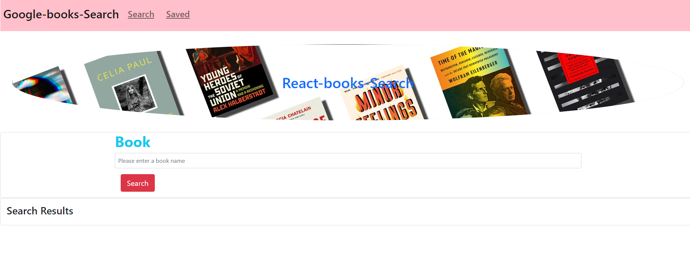

# React-Books-Search

## Description
This is the Mern Stack application built to retriev the list of books Using google books search Api.
It has 2 pages searcha nd saved. When we search for a book it displays lists of books with the title , name of author, description, info link , image of the book. It has 2 buttons, one to but the book and other button will store the book to the db. once stored it can seen in the saved page.

## Technolgies used
* React
* Express
* NODEJS
* MONGODB
* MONGOOSE
* Axios

## Screenshots

## Issues
as of now the save book is not saving in the db and couldnt retrieve it from the saved page.The post request keeps failing with 404 error

## herokku link
[reac-books-search](https://book-googl-search.herokuapp.com/)